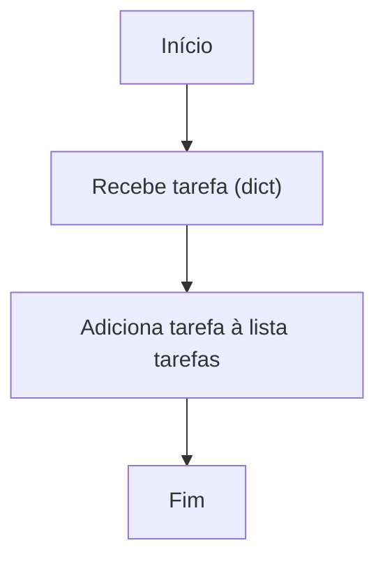
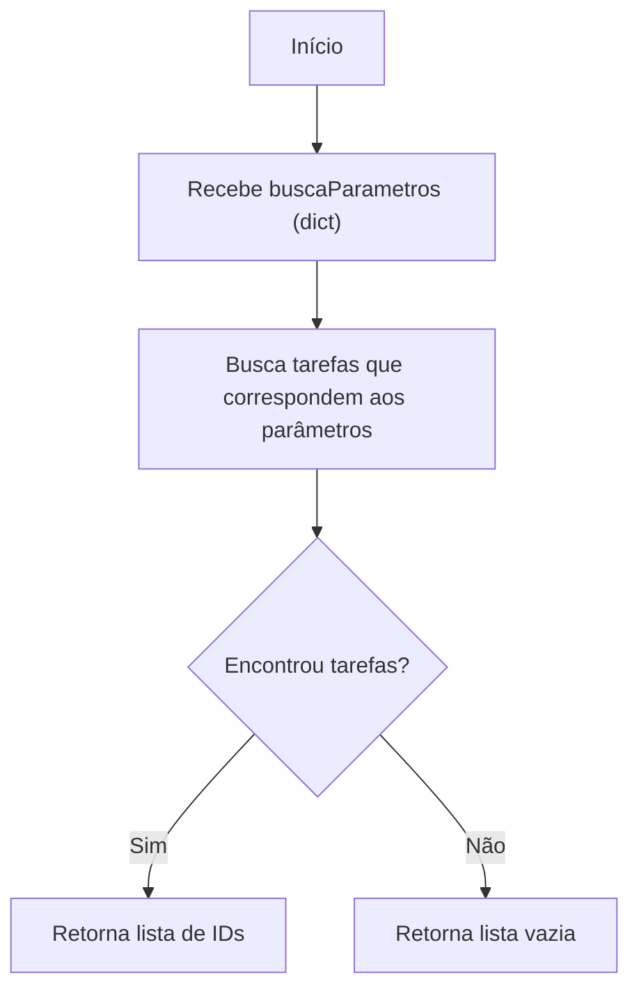
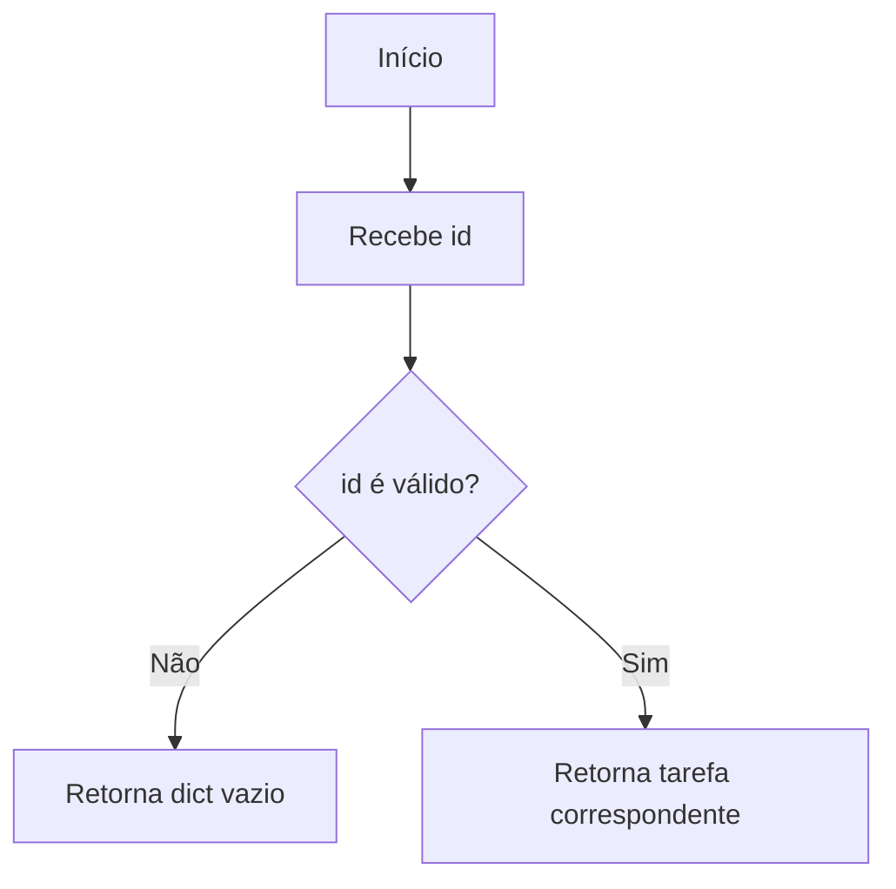
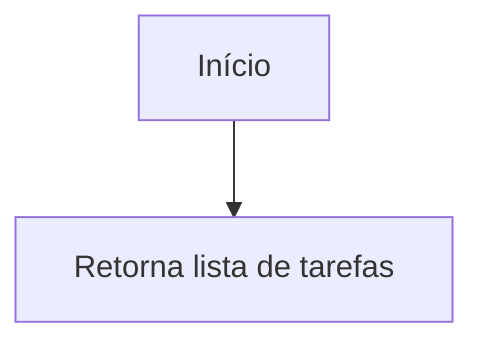
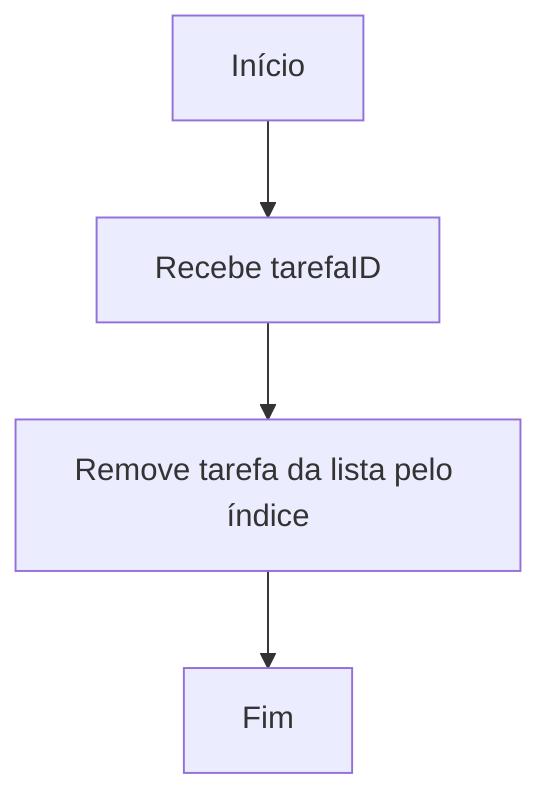
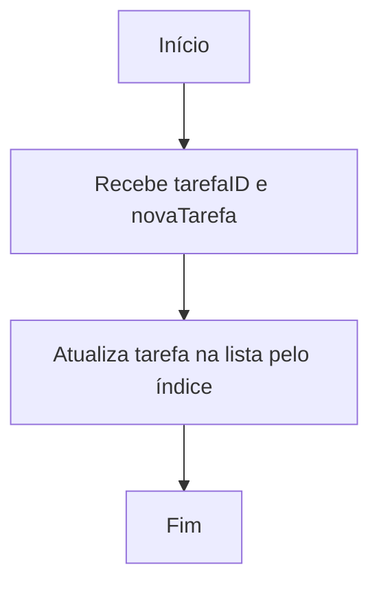

# Fluxogramas do programa

---

## Fluxograma das funções do CRUD

### adicionarTarefa(tarefa: dict)

### buscarTarefa(buscaParametros: dict)

### buscarTarefaID(id: int)

### listarTarefas()

### deletarTarefaID(tarefaID: int)

### atualizarTarefa(tarefaID: int, novaTarefa: dict)

